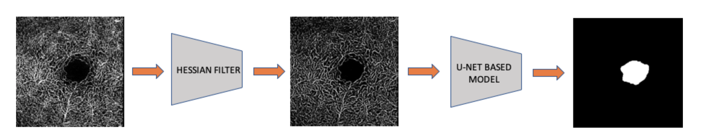

# FAZ-Segmentation
[**Bachground**](#background) | [**Setup environment**](#setup-environment) | [**Train and test**](#train-and-test) | [**Flash app**](#flask-app)

## Background
OCT Angiography (OCTA) has recently attracted a lot of attention as a new diagnostic method in ophthalmology. It is a non-invasive imaging technique that uses motion contrast to generate angiographic images in a matter of seconds without the need of contrast agents. OCTA thus has a great potential in diagnosing and monitoring various retinal diseases such as age-related macular degeneration, retinal vascular occlusions, diabetic retinopathy, glaucoma, and etc.

Fovea Avasclar Zone (FAZ) is a capillary free zone at the center of macula. Because of strong support of new imaging techniques, some authors have used vanilla computer vision algorithms to extract FAZ in OCTA image for vascular disease detections that affect the retinal microcirculation. Other researchers use deep learning to solve FAZ segmentation.

In this paper, we proposed a method which combines traditional computer vision techniques (Hessian Filter and Level Set) with a Unet-based model to automatically quantify the avascular zone in OCTA image. In specific, blood vessels in OCT based angiography images will be enhanced. Then we feed those images into a U-shape semantic segmentation model to extract the FAZ. 


A full report of this work can be found [here](https://drive.google.com/file/d/1owZMp2b_wBaOWNeudv_cxfOKU_Q8our-/view?usp=sharing)


## Setup Environment
Create a virtual environment and install dependency libraries
```bash
conda create -n fazseg python=3.6
conda activate fazseg
pip install -r requirements.txt
```

Download annd setup model and dataset (2 folders `models` and `data` will be created after this step):
```bash
bash setup_model_data.sh
```

## Train and test
To train, simply run:
```bash
python train.py
```

Adjust the parameters in `config/train_config.json` before training if needed:

*  `net_type`: name of pretrained model you want to train. 
list of model:
efficentnet_b0, efficientnet_b1, efficientnet_b2, efficientnet_b3, efficientnet_b4, efficientnet_b5, Se_resnext50, Se_resnext101, Se_resnet50, se_resnet101, Se_resnet152, Resnet18, Resnet34,Resnet50, Resnet101

*  `pretrained`: boolean, using pretrained weights from ImageNet
*  `weight_path`: Weight path of old trained model
*  `train_folder`: path of raw folder of training dataset. Example: /home/user/OCTA/preprocess_OCTA/train/raw
* `valid_folder` : path of raw folder of valid dataset. Example: /home/user/OCTA/preprocess_OCTA/valid/raw
* `test_folder`: path of raw folder of valid dataset. Example: /home/user/OCTA/preprocess_OCTA/test/raw
* `classes`: number of classes. Default = 1
* `model_path`: directory which contains trained model 
* `size`: size of input image and mask
* `thresh_hold`: thresh hold for convert grayscale mask to binary mask
* `epoch`: number of training epoch
* `num_workers:` number, set number of workers for dataloader

To test model with a particular image, run:
```bash
python test.py --path_images --model_type --weight 
```

where
* `path_images`: directory of raw folder in testset (see prepare dataset above)
* `model_type`: name of pretrained model you want to train. Default: `Se_resnext50`
* `weight`: directory to weight path.


## FLask App
Build and run docker on port 2001
```bash
$ ./docker-build.sh
```

If getting error in permission
```bash
$ chmod u+x ./docker-build.sh
```

To test, the file structure should be like this:
```
├   ├── images
|       ├── raw
|           ├── 1.tif
|       ├── predict
|           ├── 1.png
```
The app will put input image in `/images/raw/`

You will have the prediction of model at `/images/predict`

In **Postman**: 
* url: http://localhost:2001/faz/predict
* METHOD: GET
* Params: 
    * Key: id
    * value: name of image such as `1.png`